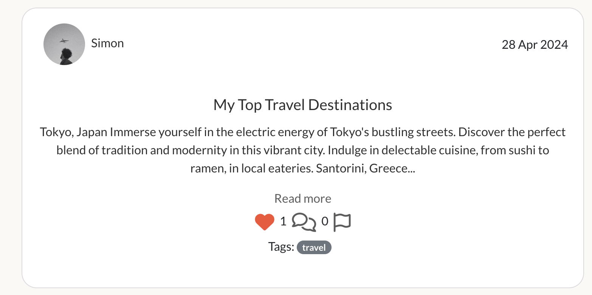

# BrainBox

BrainBox is a collaborative note-taking and sharing web application designed to facilitate knowledge exchange and community interaction. Whether you're jotting down ideas, sharing insights, or engaging in discussions, BrainBox provides a user-friendly platform for users to connect, collaborate, and learn from one another.

The live link to the site can be found here - [BrainBox](https://brain-box-f-801a044f0f43.herokuapp.com/)


## Table of Contents

- [BrainBox](#brainbox)
  * [Site Owner Goals](#site-owner-goals)
  * [User Stories](#user-stories)
  * [Mapping User Stories to Project Goals](#mapping-user-stories-to-project-goals)
  * [Design (UX)](#design--ux-)
    + [Colour Palette](#colour-palette)
    + [Typography](#typography)
  * [Wireframes](#wireframes)
  * [Features](#features)
    + [Navigation Bar](#navigation-bar)
    + [The Home Page](#the-home-page)
      - [Most Followed Profiles](#most-followed-profiles)
      - [Polls](#polls)
      - [Notes](#notes)
      - [Reports](#reports)
    + [The Feed Page](#the-feed-page)
    + [The Liked Page](#the-liked-page)
    + [Search Functionality](#search-functionality)
    + [Profile Page](#profile-page)
    + [Create New Note](#create-new-note)
      - [Tags](#tags)
    + [Note Detail Page View](#note-detail-page-view)
    + [Comments](#comments)
    + [Sign In](#sign-in)
    + [Sign Up](#sign-up)
    + [Other Features](#other-features)
  * [Future Features](#future-features)
  * [Technologies Used](#technologies-used)
    + [JavaScript and React Libraries](#javascript-and-react-libraries)
    + [Other Technologies](#other-technologies)
  * [Testing](#testing)
  * [Deployment and Development](#deployment-and-development)
  * [Credits](#credits)
  * [Acknowledgments](#acknowledgments)

<small><i><a href='http://ecotrust-canada.github.io/markdown-toc/'>Table of contents generated with markdown-toc</a></i></small>

## Site Owner Goals

- To establish a collaborative platform where users can create, share, and discuss notes on various topics.
- To facilitate knowledge-sharing and collaboration among users by providing a user-friendly and intuitive interface.
- To encourage user engagement through features such as liking, commenting, and following other users' notes.
- To maintain a seamless and enjoyable user experience with a focus on simplicity and functionality.

## User Stories

<details><summary>Create Notes</summary>

### Create Notes

**Description:** As a logged-in user, I can create new notes to capture and organize my thoughts, ideas, and information.

**Acceptance Criteria:**
>AC1: Upon accessing the note creation page, there should be input fields for title and content.

> AC2: After entering the title and content of the note, I should be able to successfully create the note.

> AC3: The newly created note should be visible in my notes collection and accessible for viewing and editing.
</details>

<details><summary>View Note Details</summary>

### View Note Details

**Description:** As a user, I can access the details of a single note to review its content and additional information.

**Acceptance Criteria:**
> AC1: When I click on a note, I should be redirected to a page displaying the full details of the note.

> AC2: The note details page should include the title, content, creation date, and any associated tags or categories.

> AC3: I should be able to navigate back to my notes collection from the note details page.
</details>

<details><summary>Edit Notes</summary>

### Edit Notes

**Description:** As the owner of a note, I can edit its contents to make updates or corrections.

**Acceptance Criteria:**
> AC1: On the note details page, there should be an option to edit the note's title and content.

> AC2: After making edits, I should be able to save the changes successfully.

> AC3: The updated note should reflect the changes immediately and accurately.
</details>

<details><summary>Delete Notes</summary>

### Delete Notes

**Description:** As the owner of a note, I can delete it to remove unnecessary or outdated information from my collection.

**Acceptance Criteria:**
> AC1: On the note details page, there should be an option to delete the note.

> AC2: After confirming the deletion, the note should be permanently removed from my notes collection.

> AC3: There should be a confirmation prompt to prevent accidental deletion of notes.
</details>

<details><summary>Like Notes</summary>

### Like Notes

**Description:** As a user, I can like notes to show appreciation and easily access important or frequently referenced information.

**Acceptance Criteria:**

>AC1: On the note details page, there should be an option to mark the note as liked.

>AC2: Liked notes should be visually distinguishable from other notes in the collection.

>AC3: There should be a dedicated page and/or filter for viewing all favorited notes for quick access.
</details>

<details><summary>View Comments on Notes</summary>

### View Comments on Notes

**Description:** As a user, I can read comments on notes to gain additional insights and perspectives.

**Acceptance Criteria:**

> AC1: On the note details page, all comments related to the note should be visible and accessible.

> AC2: Each comment should include the commenter's username, profile picture, and the time of the comment.

> AC3: Users should be able to scroll through comments if there are multiple comments on a note.
</details>

<details><summary>Add Comments to Notes</summary>

### Add Comments to Notes

**Description:** As a logged-in user, I can add comments to notes to contribute to discussions and provide feedback.

**Acceptance Criteria:**

> AC1: On the note details page, there should be a comment section where users can input their comments.

> AC2: After entering a comment, it should be displayed below the note along with the user's username and profile picture.

> AC3: Comments should be displayed in chronological order, with the newest comments appearing at the top.
</details>

<details><summary>Authentication - Sign Up</summary>

### Authentication - Sign Up

**Description:** As a user, I can create a new account to access all features available for registered users.

**Acceptance Criteria:**

> AC1: There should be a sign-up page with input fields for username and password.

> AC2: After submitting valid sign-up information, the user should receive a confirmation message and be redirected to the login page.

> AC3: Newly registered users should be able to log in immediately after signing up.
</details>

<details><summary>Authentication - Sign In</summary>

### Authentication - Sign In

**Description:** As a user, I can log in to the application to access functionalities reserved for logged-in users.

**Acceptance Criteria:**

> AC1: There should be a login page with input fields for username and password.

> AC2: After entering valid login credentials, the user should be authenticated and redirected to the home page.

> AC3: Logged-in users should have access to additional features and personalized content.
</details>

<details><summary>Authentication - Session Management</summary>

### Authentication - Session Management

**Description:** As a user, I can maintain my logged-in status even after refreshing the page until I choose to log out.

**Acceptance Criteria:**

> AC1: After logging in, the user's session should remain active across page refreshes and browser sessions.

> AC2: The user should not be required to log in again unless they explicitly log out or their session expires.

> AC3: Session management should handle scenarios such as idle timeouts and session expiration gracefully, notifying the user and prompting them to re-authenticate if necessary.
</details>

<details><summary>Authentication - Logged In Status</summary>

### Authentication - Logged In Status

**Description:** As a user, I can determine if I'm currently logged in to the application.

**Acceptance Criteria:**

> AC1: The application should display the user's logged-in status prominently, such as showing the user's username or profile picture.

> AC2: The logged-in status should persist across different pages and sessions until the user chooses to log out.

> AC3: There should be a clear indication when the user is not logged in, prompting them to sign in to access restricted content.
</details>

<details><summary>Manage Comments on Notes</summary>

### Manage Comments on Notes

**Description:** As the owner of a comment, I can delete or edit my comments for control over my contributions.

**Acceptance Criteria:**

> AC1: Each comment should have options for editing and deleting visible only to the comment owner.

> AC2: After selecting the edit option, the comment text should become editable, allowing the user to make changes.

> AC3: After selecting the delete option, a confirmation prompt should appear to prevent accidental deletion of comments.
</details>

<details><summary>Follow/Unfollow Users</summary>

### Follow/Unfollow Users

**Description:** As a logged-in user, I can choose to follow or unfollow other users to customize my feed.

**Acceptance Criteria:**

> AC1: There should be a follow button on each user's profile page.

> AC2: Clicking on the follow button should add the user to my list of followed users.

> AC3: The follow button should change to an unfollow button after I've followed the user.
</details>

<details><summary>View User Profiles</summary>

### View User Profiles

**Description:** As a user, I can visit other users' profiles to explore their notes and learn more about them.

**Acceptance Criteria:**

> AC1: There should be a clickable link or button on each note indicating the author's username/picture.

> AC2: Clicking on a user's username and/or profile picture should redirect me to their profile page.

> AC3: The profile page should display the user's bio, profile picture, and a list of their posted notes.
</details>

<details><summary>Tag Notes</summary>

### Tag Notes

**Description:** As a user, I can assign tags or categories to my notes to organize them based on topics or themes.

**Acceptance Criteria:**

> AC1: When creating or editing a note, there should be an option to add tags from a predefined list or enter them manually.

> AC2: Tags should be visible on the note details page and clickable to filter notes by the selected tag.

> AC3: Each note can have multiple tags assigned to it for comprehensive organization.
</details>

<details><summary>View All Notes by a User</summary>

### View All Notes by a User

**Description:** As a user, I can see all notes made by a specific user to catch up on their activity or explore their content further.

**Acceptance Criteria:**

> AC1: There should be a collection of all notes taken by a specific user displayed on that person's profile page.

> AC2: The notes should be in customized maps displayed in rows and columns of the user's profile page.

> AC3: There should be a button/tab with the user's liked notes on their profile page.
</details>

<details><summary>Search Notes</summary>

### Search Notes

**Description:** As a user, I can search for notes using keywords or filters to quickly find specific information within my collection.

**Acceptance Criteria:**

> AC1: On the notes collection page, there should be a search bar for entering keywords or filters.

> AC2: Upon entering a search query, the application should filter and display notes matching the search criteria in real-time.

> AC3: The search functionality should support partial matches and be case-insensitive for improved usability.
</details>

<details><summary>Update Username and Password</summary>

### Update Username and Password

**Description:** As a logged-in user, I can update my username and password for security and personalization purposes so that I can maintain control over my account and access.

**Acceptance Criteria:**

> AC1: There should be an option to update username and password accessible from the users account settings.

> AC2: Clicking on the update username option should allow the user to enter a new username and verify the changes.

> AC3: Similarly, clicking on the update password option should allow the user to enter a new password and verify the changes.
</details>

<details><summary>Edit Profile</summary>

### Edit Profile

**Description:** As a logged-in user, I can edit my profile information, including profile picture and bio.

**Acceptance Criteria:**

> AC1: There should be an edit profile option accessible from my profile page.

> AC2: Clicking on the edit profile option should open a form where I can update my profile picture, bio, and other information.

> AC3: After making changes, I should be able to save the updates successfully.
</details>

<details><summary>Accessing Navigation Bar</summary>

### Accessing Navigation Bar

**Description:** As a user, I can access a navigation bar from every page for easy navigation.

**Acceptance Criteria:**

> AC1: When I visit any page of the application, I should see a navigation bar displayed at the top of the screen.

> AC2: The navigation bar should include links/buttons to navigate to different sections of the application, such as Home, Notes, Profile, etc.

> AC3: Clicking on any link/button in the navigation bar should take me to the corresponding page without page refresh.
</details>

<details><summary>Report Inappropriate Notes</summary>

### Report Inappropriate Notes

**Description:** As a user, I can report notes that contain inappropriate content or violate community guidelines to maintain a safe and respectful environment within the platform.

**Acceptance Criteria:**

> AC1: There should be a visible option or button on each note to report it as inappropriate.

> AC2: After selecting the report option, a form or prompt should appear to provide details or reasons for the report.

> AC3: Users should receive confirmation of their report submission.

> AC4: Reported notes should be flagged for review by moderators or administrators to determine appropriate action.
</details>

<details><summary>Vote in Polls</summary>

### Vote in Polls

**Description:** As a user, I can participate in polls created by the admin to share my opinion on various topics or questions.

**Acceptance Criteria:**

> AC1: Polls should be visible and accessible to logged-in users on the platform.

> AC2: Each poll should include options for users to select their preferred choice or answer.

> AC3: After submitting my vote, the poll should update to reflect the overall voting results.

> AC4: Users should only be allowed to vote once in each poll to maintain voting integrity and accuracy.

> AC5: The poll results should be visible to all users after voting, providing transparency and engagement.
</details>

<details><summary>Routing</summary>

### Routing

**Description:** Users can move between pages seamlessly without page refresh for a smooth browsing experience, allowing efficient navigation throughout the application.

**Acceptance Criteria:**

> AC1: Transitioning between pages should not result in any noticeable delays or page refreshes.

> AC2: The URL in the browser should update dynamically based on the current page, allowing for bookmarking and sharing.

> AC3: Routing should support browser history navigation, enabling users to go back and forward between visited pages.
</details>

<details><summary>View User Statistics</summary>

### View User Statistics

**Description:** Users can see statistics about a specific user, such as bio, number of notes, followers, and following, to gauge their activity and popularity on the platform.

**Acceptance Criteria:**

> AC1: The user's profile page should display their bio, profile picture, number of posted notes, followers, and following count.

> AC2: The statistics should be updated in real-time to reflect any changes in the user's activity.
</details>

## Mapping User Stories to Project Goals

- **Create Notes:** Supports the goal of providing users with a platform to capture and organize their thoughts effectively.
- **View Note Details:** Contributes to the goal of enabling users to access detailed information about their notes for better understanding and organization.
- **Edit Notes:** Aligns with the goal of allowing users to maintain accurate and up-to-date notes by making necessary edits.
- **Delete Notes:** Supports the goal of helping users manage their notes by removing unnecessary or outdated information.
- **Like Notes:** Enhances user engagement and promotes important or frequently referenced notes, contributing to a vibrant community.
- **View Comments on Notes:** Facilitates discussions and enhances user interactions by providing insights and perspectives on specific notes.
- **Add Comments to Notes:** Promotes collaborative discussions and feedback among users, fostering a sense of community.
- **Authentication:** Sign Up, Sign In, Session Management, Logged In Status functionalities collectively contribute to providing users with secure access to the application and personalized experiences.
- **Manage Comments on Notes:** Empowers users to maintain control over their contributions and ensures the accuracy and relevance of comments.
- **Follow/Unfollow Users:** Enhances user experience by allowing customization of the feed and fostering connections within the community.
- **View User Profiles:** Enables users to explore and engage with other users' content, fostering a sense of community and collaboration.
- **Tag Notes:** Supports effective organization and retrieval of notes based on topics or themes, enhancing user productivity and usability.
- **View All Notes by a User:** Facilitates content discovery and exploration by providing visibility into a user's activity and contributions.
- **Search Notes:** Enhances usability and productivity by enabling users to quickly find specific information within their note collection.
- **Notebook Organization:** Provides users with advanced organization features to categorize and manage their notes effectively.
- **Update Username and Password:** Supports user account management, allowing users to personalize their accounts and maintain security.
- **Edit Profile:** Enables users to customize their profiles, enhancing their presence and personalization within the community.
- **Accessing Navigation Bar:** Contributes to a seamless and intuitive user experience by providing consistent navigation across the application.
- **Report Inappropriate Notes:** Supports the goal of maintaining a safe and respectful environment within the platform by allowing users to report notes containing inappropriate content.
- **Vote in Polls:** Enhances user engagement and interaction by enabling users to participate in polls created by the admin, contributing to a dynamic and interactive community.
- **Routing:** Ensures smooth navigation between pages without page refreshes, enhancing user experience and efficiency.
- **View User Statistics:** Enables users to gauge the activity and popularity of specific users on the platform, fostering transparency and engagement.

## Design (UX)

### Colour Palette

In BrainBox, we've carefully selected a color palette to enhance readability, promote creativity, and provide a visually appealing experience. Here's a breakdown of our color choices:


This color scheme was created by [Coolors](https://coolors.co/).

- #2F2F2F: This subdued charcoal shade serves as a smoother contrast to the lighter elements, offering a refined alternative to stark black.

- #FAF9F6: Our page background color, a soft off-white hue, creates a welcoming contrast against the content, ensuring clarity and readability.

- #F48F66: Utilized for hover effects and page navigation highlights, this playful apricot color adds a touch of vibrancy and encourages exploration.

- #067BC2: A vivid azure blue, adds a splash of color for additional detailing, infusing energy and dynamism into the interface.

- #C4E7fD: This serene sky blue tone adorns the navigation bar and provides subtle detailing throughout the application, contributing to a cohesive and polished aesthetic.

### Typography

*Google Fonts was used to import the fonts.*

The font used for this webpage was **Lato** a sans-serif font for clear readability that aligns with the overall page style.


## Wireframes

Wireframes were produced using Balsamiq. These wireframes were created prior to the project, serving as a conceptual representation of the forum's layout and features. Please note that they may not precisely reflect the final project, as some elements and features are subject to change or implementation. 

<details>

<summary>Wireframe</summary>


</details>

## Features 

### Navigation Bar

The navigation bar adapts based on the user's sign-in status, offering different functionalities accordingly. When signed out, it provides options for signing in or registering. Once signed in, the navigation bar displays personalized options such as profile access and note creation.


*Navigation bar for signed-out users*


*Navigation bar for signed-in users*

An active class highlights the current page's link in an orange/apricot color, providing visual feedback to users.

On smaller screens, the navigation bar transforms into a hamburger icon, revealing a side slide-out menu for easier navigation.


*Closed hamburger menu on small screens*


*Open hamburger menu on small screens*

### The Home Page

The content of the homepage adapts based on the user's authentication status. When signed out, it displays general information and prompts users to sign in or register. Once signed in, the homepage showcases personalized content such as most followed profiles, polls, and recent notes from other users.


*Home page when not signed in*


*Home page when signed in*

#### Most Followed Profiles 

The homepage displays the most followed profiles, allowing users to explore and connect with popular contributors. The option to follow these profiles is reserved for signed-in users.


#### Polls

Polls are featured on the homepage, providing users with interactive content. However, access to polls is limited to signed-in users.


*Polls on the homepage for signed-in users*


*Polls when not signed in - prompting the user to sign in to participate*


*Polls for signed-in users, showing current voting status*


*Polls for signed-in users, displaying voting status after voting*

#### Notes

The main section of the homepage features previews of recently created notes by users. Signed-in users can like notes and view note details, including comments.



#### Reports

Users have the option to report inappropriate content by clicking the flag icon on note previews. A modal displays with a report form for user feedback.


### The Feed Page

The feed page displays the most recent notes from users that the current user follows. The layout is similar to the homepage.


*The feed page*

### The Liked Page 

The liked page displays notes that the current user has liked from other users. The layout is similar to the homepage.


*The liked page*

### Search Functionality 

The home page, feed page, and liked page include a search bar with functionality to search for titles, users, and tags.

### Profile Page 

The profile page displays the number of followers, users followed, and notes created by the current user. Users can edit their personal information, change their profile picture, and add a bio for customization.


*The profile page*


*The more menu on the profile page*


*Editing profile information*


*Changing username*


*Changing password*

### Create New Note

When the user clicks on "Create New Note" in the navbar, they are redirected to a form to create a new note.


*The create new note form*

#### Tags

Users can add tags to their notes. By typing in a tag and pressing enter, the tag is added to the note.


*Adding tags to a note*

### Note Detail Page View

Clicking on a note redirects the user to the note page to view details, edit, or delete the note.


*Displays all of the note's text*


*Clicking on the three dots opens a more menu with options to edit or delete the note.*


*If the user chooses to delete the note, a modal appears asking for confirmation. Pressing cancel closes the modal, while pressing delete deletes the note.*


*The edit option for the note*


*If the user wants to edit their note, they are redirected to an edit form where all their previous filled out information is already in place, allowing them to update the note as they like.*

### Comments

On the note details page, all users can add comments to the notes. They can also edit and delete their own comments. 


*View comments*


*Add comment*


*Updated comment count from 1 to 2 in this case*


*Users can choose to edit or delete a comment*


*Delete comment modal*

### Sign In

Sign in form for the user to sign in to the site.


### Sign Up

Sign up form for the user to sign up to the site.


### Other Features 

Infinite Scrolling: Both the notes and comments sections utilize infinite scrolling, providing users with a seamless browsing experience. As users scroll through notes or comments, additional content is dynamically loaded, eliminating the need for manual pagination and allowing for smooth navigation through extensive collections of content.

Real-time Updates: The application incorporates real-time updates for various interactions such as likes, comments, and votes on polls.

Responsive Design: BrainBox is built with a responsive design approach, ensuring optimal performance and usability across a range of devices and screen sizes. Whether accessed from a desktop, tablet, or smartphone, users can enjoy a consistent and intuitive experience without sacrificing functionality.

Enhanced Security: The platform prioritizes user data security with robust encryption protocols and regular security audits. User authentication, data transmission, and storage are handled securely to protect sensitive information and ensure user privacy.

Accessibility Features: BrainBox is designed with accessibility in mind, adhering to web accessibility standards to ensure inclusivity for users with disabilities. Features such as keyboard navigation, screen reader compatibility, and alternative text for images are implemented to facilitate an accessible experience for all users.

## Future Features

Explore the upcoming features planned for BrainBox. These enhancements aim to improve usability and expand functionality. Below are user stories for this project that have not yet been implemented in this deployment cycle. Check out the details below!

<details><summary>Notebook Organization (In Progress)</summary>

### Notebook Organization (In Progress)

**Description:** Allow users to organize their notes into notebooks or folders for better categorization and management.

**Acceptance Criteria:**

> AC1: Implement an option to create new notebooks or folders from the notes collection page.

> AC2: Enable users to add notes into different notebooks for organization.

> AC3: Display notes grouped by notebooks and enable easy navigation between notebooks.
</details>

<details><summary>Dark Mode</summary>

### Dark Mode

**Description:** Allow users to toggle between light and dark modes to customize the appearance of the application and reduce eye strain in low-light environments.

**Acceptance Criteria:**

> AC1: Add a settings option accessible from the user profile or navigation bar.

> AC2: Display an option to enable/disable dark mode upon clicking on the settings option.

> AC3: Ensure immediate change of the application's color scheme upon toggling dark mode.
</details>

<details><summary>Note Versioning</summary>

### Note Versioning

**Description:** Enable users to view and restore previous versions of notes to track changes and revert to earlier versions.

**Acceptance Criteria:**

> AC1: Automatically save and timestamp each version of a note when changes are made.

> AC2: Provide an option to view version history and revert to a specific version from the note details page.

> AC3: Allow users to compare different versions and identify differences before restoring a previous version.
</details>

<details><summary>Collaboration</summary>

### Collaboration

**Description:** Facilitate collaboration between users on notes, allowing them to work together on projects and share ideas.

**Acceptance Criteria:**

> AC1: Implement an option to invite other users to collaborate on a note.

> AC2: Enable collaborators to view and edit the note simultaneously in real-time.

> AC3: Ensure changes made by one collaborator are immediately visible to others, with graceful conflict resolution.
</details>

<details><summary>Export Notes</summary>

### Export Notes

**Description:** Enable users to export their notes in various formats for backup or sharing with others outside the application.

**Acceptance Criteria:**

> AC1: Provide an option to export notes on the note details page or in the settings.

> AC2: Allow users to choose the export format, such as PDF, TXT, or Markdown.

> AC3: Generate and download the notes in the chosen format after selection.
</details>

<details><summary>Import Notes</summary>

### Import Notes

**Description:** Allow users to import notes from external sources for migration or integration with other note-taking applications.

**Acceptance Criteria:**

> AC1: Implement an option to import notes in the settings or note creation page.

> AC2: Enable users to upload files or link external sources for importing notes.

> AC3: Ensure correct parsing and display of the imported notes within the user's collection after importing.
</details>

<details><summary>Notification Preferences</summary>

### Notification Preferences

**Description:** Enable users to manage their notification preferences to control the types of notifications they receive and how they receive them.

**Acceptance Criteria:**

> AC1: Add a settings option accessible from the user profile or navigation bar.

> AC2: Include an option to manage notification preferences within the settings.

> AC3: Allow users to customize notification settings for various events, such as new comments, likes, or followers.
</details>

<details><summary>Share Notes</summary>

### Share Notes

**Description:** Allow users to share their notes with others via email for effective collaboration and communication.

**Acceptance Criteria:**

> AC1: Provide options to share the note via email on the note details page.

> AC2: Open a modal or dialog with pre-filled content for easy sharing upon clicking on the share option.

> AC3: Ensure recipients of the shared note can view the note content without requiring a user account.
</details>

## Technologies Used

**React:** Utilized as the core JavaScript library for building the user interface.

**Create React App:** Employed to initialize the React project, providing a standardized setup.

### JavaScript and React Libraries

- Axios: Used to make requests to the backend API.
- Bootstrap and React Bootstrap: Utilized for responsive styling and layout design.
- React Router: Implemented for enabling routing within the application.
- React Infinite Scroll Component: Integrated to add infinite scroll functionality, enhancing user experience.
- JWT Decode: Employed for decoding JSON Web Tokens, essential for authentication purposes.
- Heroicons: Used for importing customizable icons to enhance the user interface.


### Other Technologies

- [Heroku](https://dashboard.heroku.com/login) - was used as the cloud based platform to deploy the site on.
- [GitHub](https://github.com/) - Used for version control and agile tool.
- [Gitpod](https://gitpod.com/) As the IDE used to develop the application.
- [Balsamiq](https://balsamiq.com/) - Used to generate Wireframe images.
- [Google Fonts](https://fonts.google.com/) - Used to import and alter fonts on the page.
- [Favicon](https://favicon.io/) - Used to create the favicon.
- [Adobe Express](https://new.express.adobe.com/) Used to create the logo.
- [W3C](https://www.w3.org/) - Used for HTML & CSS Validation.
- [PostgreSQL](https://www.postgresql.org/) was used as the database for this project.
- [Lucidchart](https://lucid.app/documents#/dashboard) - used to create the database schema design
- [Chrome Dev Tools](https://developer.chrome.com/docs/devtools/) - Used for overall development and tweaking, including testing responsiveness and performance.

## Testing

The full testing documentation can be found in [TESTING.md](./TESTING.md)

## Deployment and Development
- From the begining of development, the project started out and continued from the tutorial provided by Code Institute "Moments" unit on the "Advanced Front-end specialization" module.

The project was developed using GitHub and GitPod platforms...
- Navigate to: "Repositories" and create "New".
- Mark the following fields: ✓ Public ✓ Add a README file.
- Select template: "Code-Institute-Org/python-essentials-template".
- Add a Repository name
- ...and create Repository.

... and suffered various executions using the inbuild Terminal.

For Commits on this project, the following commands ran:
- ```git add .``` <- Stages before commiting.
- ```git commit -m "written imperative declaration"``` <- Declares changes and updates.
- ```git push``` <- Push all updates to the GitHub Repository.

Through development the following commands ran:
- ```npm install``` <- Installs Reacts dependencies
- ```npm run start``` <- Runs the app in local environment

Additionally, the following:
- ```npm install react``` <- Installs React library. JavaScript library for building user interfaces.
- ```npm install react-router-dom``` <- Installs React Rounter DOM. Library for handling navigation and routing in React applications.
- ```npm install axios``` <- Installs Axios library. Library used for making HTTP requests.
- ```npm install react-bootstrap``` <- Installs React Bootstrap. Library components that have been re-implemented using React.
- ```npm install react-modal``` <- Installs Pop up Modal. Library for using modal dialogs and pop-up windows.

The database is being hosted on ElephantSQL:
- Create an account and select TinyTurtle plan.
- From Details collect the URL and paste it on Heroku Config Var.

The static files are being hosted on Cloudinary:
- Create and account.
- From the dashboard collect the API Environment variable and paste it on Heroku Config VAR.

...and hosted on Heroku:
- Create a Heroku account (Code Institute students can apply for the Student Pack)
- Navigate to: "Create new app" add a unique name "connect-network" and select your region. Click "Create App"
- Head over to "Settings" tab and apply the respective config VARs
- Move to "Deploy" section and select "Github" method
- From here search for the repository name and chose the respitory from the GitHub account.
- Hit "Connect" and "Enable Automatic Deploys" to keep the the repository in parallel to Heroku.
- Manually "Deploy Main Branch".
- Upon successful deployment, retrieve the link for the mock terminal.
- The live app can be found [here](https://brain-box-f-801a044f0f43.herokuapp.com/).

The backend for this project is my brainbox-api and can be found [here](https://github.com/elindalenback/brainbox-api).

## Credits 

- [W3Schools](https://www.w3schools.com/): For helpful tutorials and references.
- [Bootstrap](https://react-bootstrap-v4.netlify.app/getting-started/introduction/): Used for responsive styling and layout design.
- [Stack Overflow](https://stackoverflow.com/): For troubleshooting and finding solutions to coding challenges.
- [Code Institute - Momment Walk Through](https://github.com/mr-fibonacci/moments): Referenced for guidance and inspiration.
- [TiagoMA90 - Connect project](https://github.com/TiagoMA90/connect): Utilized for the Reports Functionality.
- [fsjavier - hoodsap project](https://github.com/fsjavier/hoodsap-api/tree/main/frontend): Used for the Tags Functionality.

## Acknowledgments

Many thanks to my tutor Gareth McGirr for your help and support.

Special thanks to the tutors at code institute for your valuable feed back.

An extra big thank you to my fellow student Anton Eriksson for all the trouble shooting and collaboration.