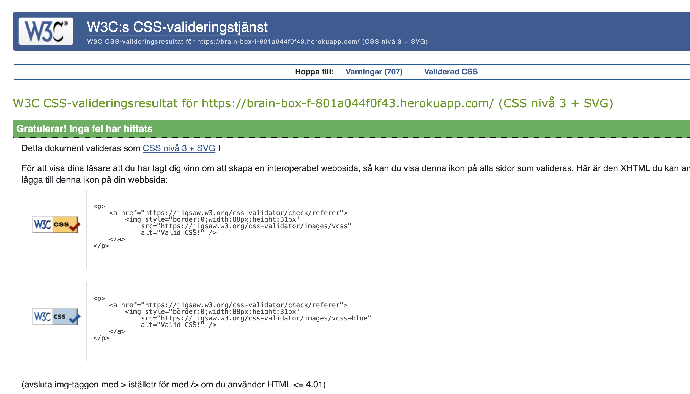

# Testing:

## Validator Testing

### ESLint
Eslint has been installed and configured. All code passes without any errors that affect the functionallity. The errors loged are related to react/prop-types.

### CSS
No errors were found when passing my CSS file through the official [W3C CSS Validator](https://jigsaw.w3.org/css-validator/)

 

 
CSS

 

## Accessibility
 All pages received high scores in terms of Accessibility, Best Practices, and SEO. The lower scores in Performance are primarily attributed to issues such as render-blocking resources and the size of images

 ### Python
All Python files were run through [Pep8](https://pep8ci.herokuapp.com/#) with no errors found. 

## Browser Testing
- The Website was tested on Google Chrome, Firefox, Safari browsers with no issues noted.

## Device Testing
- The website was viewed on a variety of devices such as Desktop, Laptop, iPhone 8, iPhoneXR and iPad to ensure responsiveness on various screen sizes in both portrait and landscape mode. The website performed as intended. The responsive design was also checked using Chrome developer tools across multiple devices with structural integrity holding for the various sizes.

## Manual Testing

### Site Navigation
| Element               | Action     | Expected Result                                                    | Pass/Fail |
|-----------------------|------------|--------------------------------------------------------------------|-----------|
| NavBar                |            |                                                                    |           |
| Site Name (logo area) | Click      | Redirect to home                                                   | Pass      |
| Home Link             | Click      | Redirect to home                                                   | Pass      |
| Create new note              | Click      | Opens the create note form                                            | Pass      |
| Add note              | Display    | Only visible if user in session                                    | Pass      |
| Feed                  | Click      | Opens the feedpage                                                 | Pass      |
| Feed                  | Display    | Only visible if user in session                                    | Pass      |
| Like               | Click      | Opens the Like page                                             | Pass      |
| Like               | Display    | Only visible if user in session                                    | Pass      |
| Logout Link           | Click      | logges you out                                                     | Pass      |
| Logout Link           | Display    | Only visible if user in session                                    | Pass      |
| Sign Up Link          | Click      | Open Sign up page                                                  | Pass      |
| Sign Up Link          | Display    | Not visible if user in session                                     | Pass      |
| Log In Link           | Click      | Open Login page                                                    | Pass      |
| Log In Link           | Display    | Not visible if user in session                                     | Pass      |
| All Nav Links         | Hover      | Makes links gray                                                   | Pass      |
|                       |            |                                                                    |           |
| Mobile View           |            |                                                                    |           |
| Hamburger Menu        | Responsive | Display when screen size reduces to medium size                    | Pass      |
| Site Name (logo area) | Click      | Redirect to home                                                   | Pass      |
| Home Link             | Click      | Redirect to home                                                   | Pass      |
| Create new note              | Click      | Opens the add note form                                            | Pass      |
| Create new note              | Display    | Only visible if user in session                                    | Pass      |
| Feed                  | Click      | Opens the feedpage                                                 | Pass      |
| Feed                  | Display    | Only visible if user in session                                    | Pass      |
| Like               | Click      | Opens the Like page                                             | Pass      |
| Like               | Display    | Only visible if user in session                                    | Pass      |
| Logout Link           | Click      | logges you out                                                     | Pass      |
| Logout Link           | Display    | Only visible if user in session                                    | Pass      |
| Sign Up Link          | Click      | Open Sign up page                                                  | Pass      |
| Sign Up Link          | Display    | Not visible if user in session                                     | Pass      |
| Log In Link           | Click      | Open Login page                                                    | Pass      |
| Log In Link           | Display    | Not visible if user in session                                     | Pass      |
|                       |            |                                                                    |           |

### Note Preview on Home Page:
| Element              | Action            | Expected Result                                                                  | Pass/Fail |
|----------------------|-------------------|----------------------------------------------------------------------------------|-----------|
| Like              | Click             | User can like the note and show appreciation                       | Pass      |
| Read more            | Click             | Opens the full content of the note                                               | Pass      |
| Comment              | Click             | Opens the notes page so you can comment                                          | Pass      |
| Create new note link in nav       | Click             | Opens the notes page                                                             | Pass      |
| Username             | Click             | Opens the profile page for the profile                                           | Pass      |
| Tags                 | Display           | Displays the tags                                                                | Pass      |
| Date                 | Display           | Displays when the note was created                                               | Pass      |
| Like     | Display           | A heart is displayed and when clicked the user can like or unlike the note     | Pass      |

### Most followed profiles/This weeks poll:
| Element               | Action     | Expected Result                                                    | Pass/Fail |
|-----------------------|------------|--------------------------------------------------------------------|-----------|
| Profile pics          | Display    | Redirect to profile                                                | Pass      |
| Usernames             | Display    | Displays the username                                              | Pass      |
| Follow/Unfollow       | Click      | Follows the profile you chosed                                     | Pass      |
| Follow/Unfollow       | Display    | Only visible if user in session                                    | Pass      |
| Poll                  | Display    | Only visible if user in session                                    | Pass      |
| Poll button           | Click      | choose what you want to answer on the poll                         | Pass      |
| Sign in to see poll   | Click      | Not visible if user in session                                     | Pass      |

### Reporting a Note:
| Element                | Action            | Expected Result                                                      | Pass/Fail |
|------------------------|-------------------|----------------------------------------------------------------------|-----------|
| Flag Icon              | Click             | Opens the report modal for the selected note                         | Pass      |
| Report Modal           | Opened            | Modal opens with appropriate content and fields for reporting        | Pass      |
| Reason Selection       | Select            | User can select a reason for reporting the note                      | Pass      |
| Description Input      | Type              | User can provide a description for the report (optional)             | Pass      |
| Report Button          | Click             | Submits the report for the selected note                              | Pass      |
| Success Message        | Displayed         | Success message displayed upon successful report submission          | Pass      |
| Cancel Button          | Click             | Closes the report modal                                              | Pass      |

### Note detail page:
| Element                 | Action            | Expected Result                                                                 | Pass/Fail |
|-------------------------|-------------------|---------------------------------------------------------------------------------|-----------|
| Like                 | Click             | User can like a note and show appreciation                     | Pass      |
| Read more               | Click             | Opens the full content of the note                                              | Pass      |
| User Comments           | Display           | Displays correct name date time and comment body                                | Pass      |
| User Comments           | Display           | Comments are ordered oldest to newest                                           | Pass      |
| Update comment button   | Display           | Button only visible if user is the comment author                               | Pass      |
| Update comment button   | Click             | Opens Update Comment Form                                                       | Pass      |
| Update comment form     | Leave empty       | Won't submit without content                                                    | Pass      |
| Delete comment button   | Display           | Button only visible if user is the comment author                               | Pass      |
| Delete comment button   | Click             | Opens delete comment confirmation page                                          | Pass      |
| Edit note button      | Display           | Button only visible if user is the notes author                                  | Pass      |
| Edit note button      | Click             | Opens the note edit form Form                                                          | Pass      |
| Delete note button      | Display           | Button only visible if user is the notes author                                  | Pass      |
| Delete note button      | Click             | Opens delete note confirmation modal                                            | Pass      |
| Delete note modal      | Click delete             | Deletes the note                                            | Pass      |
| Delete note modal      | Click cancel             | Closes the modal                                            | Pass      |
| Username                | Click             | Opens the profile page for the profile                                          | Pass      |
| Tags                    | Display           | Displays the tags                                                               | Pass      |
| Date                    | Display           | Displays when the note was created                                              | Pass      |
| Like         | Display           | A heart for likes - updates in real time when user likes/unlikes a note    | Pass      |
 
### Profile page
| Element               | Action     | Expected Result                                                    | Pass/Fail |
|-----------------------|------------|--------------------------------------------------------------------|-----------|
| Profile pics          | Display    | Redirect to profile                                                | Pass      |
| Bio                   | Display    | Displays the bio                                                   | Pass      |
| Notes                 | Display    | Displays how many notes you have created                            | Pass      |
| Followers             | Display    | Displays how many followers you have                               | Pass      |
| Following             | Display    | Displays how many you are following                                | Pass      |
| Edit profile          | Click      | Opens the the edit profile page                                    | Pass      |
| Edit profile          | Display    | User can edit bio and profile picture                              | Pass      |
| Change username       | Click      | User can change username                                           | Pass      |
| Change password       | Click      | User can change password                                           | Pass      |
| Notes                 | Display    | Users can see there own notes                                      | Pass      |

### Fixed Bugs

1. **Tag Display Issue**

   Previously, there was a bug where tags were not displaying properly on the frontend. The issue was traced back to the backend code, where the incorrect tag data was being used. Specifically, the system was attempting to render "tag_data" instead of "tag". This has been rectified by updating the backend logic to correctly pass the tag information, ensuring that tags now display as intended.

2. **Poll Page Data Routing Problem**

   Another bug encountered was related to the functionality of the poll page. Data was not being directed to the appropriate destination, resulting in incorrect display or processing of poll information. Through debugging, it was discovered that the data routing mechanism was flawed, causing the data to be misdirected. This issue has been addressed by implementing the correct routing logic, ensuring that poll data now reaches its intended location seamlessly.

3. **Frontend-Backend Interaction Issue**

   There was a bug preventing my frontend deployed project from effectively communicating with my backend. This issue was resolved after reinstalling all the backend requirements following the Code Institute Moments walkthrough. Ensuring the correct versions in my backend for this project called brainbox-api enabled successful deployment, resolving the issue and restoring full functionality.

### Unfixed Bugs

#### 1. Login Issues on Safari Mobile Browser

There are reported difficulties when attempting to log in using the Safari browser on mobile devices. Users encounter obstacles preventing successful login, which could potentially impact user experience. This issue was identified during the testing phase and remains unresolved. Users can log in if they disable cookies in their settings.

#### 2. Users can access the polls creation url

This is supposed to be restricted to admin only. At this point of deployment unfortinutelly that issue is not resolved. 